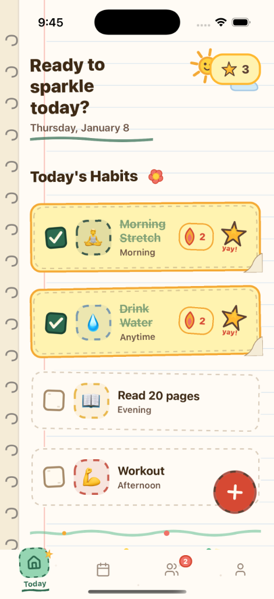
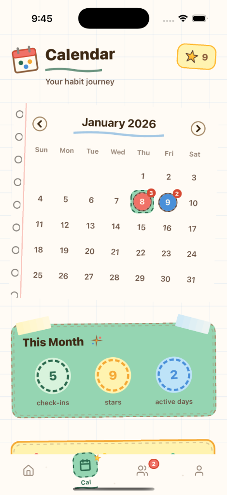
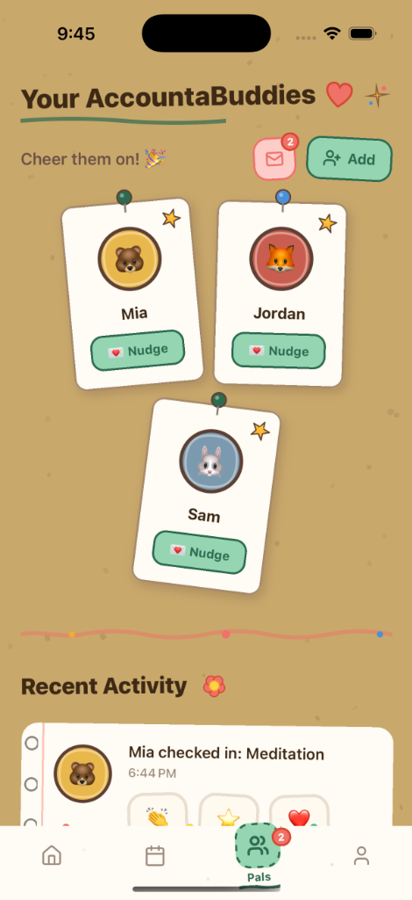

# Karle - Habit Tracker

A delightful habit tracking app designed to help users build sustainable habits through small, manageable daily actions. The app emphasizes gentle accountability, social support through buddies, and celebrates every tiny win along the way.

**Website**: [karle.today](https://karle.today)

---

## About

Karle is a mobile application that reimagines habit tracking with a warm, approachable design. Instead of the typical cold, clinical productivity app experience, Karle features a unique hand-drawn, crayon-on-paper aesthetic that makes building habits feel like play, not work.

The app is built around the philosophy that small, consistent actions lead to meaningful change. Rather than overwhelming users with complex goal-setting frameworks, Karle focuses on daily check-ins, gentle encouragement, and celebrating progress over perfection.

---

## Screenshots

  
  
  
  

---

## Features

### Habit Management
- Create custom habits with emoji icons, colors, and difficulty levels
- Set frequency options: daily, weekdays only, or custom day selection
- Configure time windows: morning, afternoon, evening, or anytime
- Privacy controls for what buddies can see

### Daily Check-ins
- One-tap check-ins with satisfying haptic feedback
- Optional mood tracking with stickers
- Stars earned based on habit difficulty

### Streak Tracking
- Visual streak badges showing current progress
- Milestone celebrations at 3, 7, 14, 21, 30, 50, and 100 days
- Historical streak data per habit

### Buddy System
- Connect with friends via shareable invite codes
- Real-time activity feed of buddy check-ins
- Send gentle encouragement through nudges
- React to buddy activities with claps, stars, hearts, and more
- Push notifications for buddy events

### Profile and Stats
- Lifetime star collection
- Weekly progress visualization
- Achievement badges for milestones
- Personalized weekly recaps

---

## Technology Stack

### Mobile Development
- **React Native** with **Expo** framework
- **Expo Router** for file-based navigation
- **TypeScript** for type safety

### Backend and Database
- **Supabase** for PostgreSQL database and real-time features
- **Supabase Auth** with Apple Sign-In and email/password authentication
- Row Level Security for data protection

### State Management
- **React Context** with custom hooks
- **AsyncStorage** for local persistence
- Cloud sync with offline fallback

### UI and Experience
- Custom SVG illustrations and doodles
- **Expo Haptics** for tactile feedback
- **Expo Notifications** for push notifications

---

## Design Philosophy

### Gentle Accountability
The app never shames users for missing habits. All messaging is encouraging and understanding.

### Tiny Wins Matter
Every small action is celebrated with stars, badges, and visual feedback.

### Social Support Without Pressure
Buddies can encourage but not judge. Privacy controls let users share what they are comfortable with.

### Playful Not Serious
The crayon aesthetic reminds users that building habits should feel like play, not work.

### Progress Over Perfection
Returning after missed days is celebrated with the Comeback Kid badge.

---

## Achievement Badges

| Badge | Requirement |
|-------|-------------|
| First Step | Complete 1 check-in |
| 7-Day Streak | Maintain a 7-day streak |
| Comeback Kid | Return after missing days |
| Star Collector | Earn 50 total stars |
| 30-Day Champion | Maintain a 30-day streak |
| Early Bird | Complete 5 morning check-ins |
| Habit Builder | Create 5 habits |
| Century Club | Complete 100 check-ins |

---

## Platform Availability

- **iOS**: Available on the App Store
- **Android**: Coming soon

---

## Contact

For questions, feedback, or support, visit [karle.today](https://karle.today).
